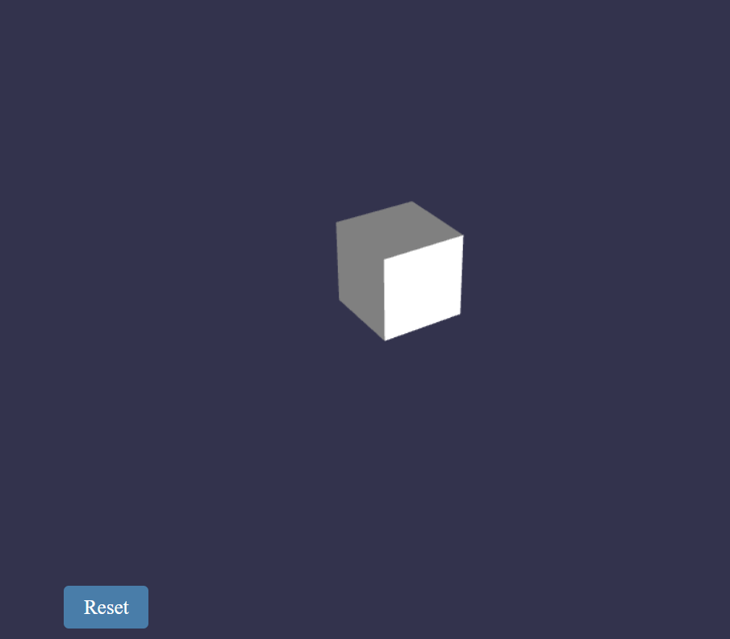

# Babylon Mesh Assignmemnt

This application allows users to create a basic Babylon.js project with a cube mesh object in the scene and implement extrusion feature with cursor movement.


- Demo Video: [Cube Extrusion](assets\BabylonMeshExtrusion_Demo.mp4)

## Getting Started

Follow the instructions below to set up the project environment and run the application.

### Prerequisites

Before running the application, ensure you have the following installed:

- [Node.js](https://nodejs.org) (version 12 or above)

### Installation

1. Clone the repository to your local machine:

```bash
git clone https://github.com/SahityaVatturi/Babylon_Challenge.git
```

2. Navigate to the project directory:

```bash
cd Babylon_Challenge
```

3.  Install the required dependencies:
    `npm install`
    `npm install babylonjs` (optional but should be used if you encounter babylonjs installation errors)
    `npm install -D @babylonjs/core` (optional but should be used if you encounter babylonjs installation errors)

4.  To run the application, use the following command:
    `npm run dev`
    Open your web browser and navigate to the link shown in the terminal.

# Application Features

1. Basic Babylon.js Project Environment
   The application provides a basic setup for a Babylon.js project, including a scene, camera, and rendering environment.

2. Cube Mesh Object
   A cube mesh object is automatically created and added to the scene.

3. Extrusion Features
   The application allows you to extrude a selected face of the cube using the following features:

   - User Input
   - Click on a face of the cube to select it for extrusion.
   - On the mouse drag, the extrusion operation will be completed, and the original mesh will be modified with the extruded face
   - Click on the Reset button, to reset the scene and start over.

# Limitations

- The application is optimized for modern web browsers that support WebGL. It may not work as expected on older browsers.

# License

This project is licensed under the MIT License - see the [LICENSE](LICENSE) file for details.
